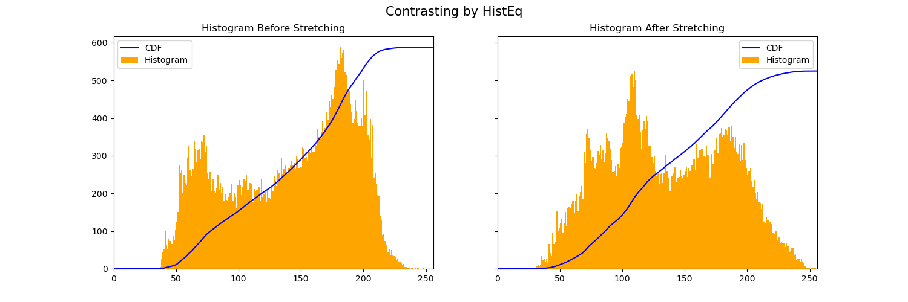

# Virtual Reality Toolkit

Project Webpage with demos: [](https://sites.google.com/wisc.edu/vr-toolkit/home)

## Abstract:

Vision impairment severely impacts quality of life among adult populations, and people
with vision impairment often have lower rates of workforce participation as well as work
productivity. We plan to implement a Virtual Reality (VR) software stack that would help
people with low vision in specific, to identify objects, see images and read better. Through
our VR stack, we provide the ability to change the size of text by magnification, contrasting
colors in images, and by generating captions for these images. To mitigate dealing with issues
related to reading these captions, we will also implement a text-to-speech framework for
these captions. This software stack can be embedded into VR headsets
or special glasses to help people suffering from these kind of problems. With the advent of
Virtual Reality and the advances being made towards the Metaverse, we hope our work will
help people with low vision see better and provide them with a more inclusive tech-space in
the future.


## Approach:

Leading companies have developed state-of-art applications which are supporting people with impaired visions. Microsoft has presented Seeing VR, a set of 14 tools that enhance VR application for people with low vision by providing visual and audio augmentations [5]. Meta is utilizing Automatic Alternative Text (AAT) to utilize object recognition to caption photos which helps
visually impaired individuals [6].

Our approach to solve the problem has four main components: Magnification, Contrast, Object
Captioning, and Text-to-Speech.

- Magnification: The most commonly used in vision enhancement to enable people with
impaired vision to see details. The field view of the camera is adjusted so that magnification
level is adjusted.
- Contrast: Increased luminance contrast is important for visually impaired people. We
plan to enhance the brightness difference between each pixel and the average of its adjacent
pixels. We plan to integrate high contrast color schemes [7] which will be best for people
with low vision.
- Object Captioning: We plan to recognize objects/situations in the field view and include
captions with appropriate magnification and contrasting which will help them recognize
the objects.
- Text-to-Speech: Integrating Text-to-speech with object captioning system will help
visually impaired people understand the field view and surrounding environment with
better rate.

We plan to work on existing approaches in the sense of making the use of VR, but we plan on giving
this a new direction. VRs are mainly used to provide entertainment benefits, however, we will be using it to help people.



## Repository Code API:

### Dependencies:

To install dependencies for the functionality of this repository, run

```
pip install -r requirements.txt
```

To add `tesseract` to `PATH` if the previous installation throws an exception, run the following commands in the environment:

```
brew link libtiff                     
brew link libpng
brew link jpeg
brew install tesseract
```

### Command to run Contrast by Stretching:

In the `contrast` directory, run

```
python3 stretching.py --image_path [IMG_PATH] --input_path [BW_PATH] --output_path [OUT_PATH]
```

- `[IMG_PATH]`: Path of input image
- `[BW_PATH]`: Path to store grayscale image of input generated
- `[OUT_PATH]`: Path to store output grayscale image after contrasting

### Command to generate Histogram+CDF from a set of input-output images:

In the `contrast` directory, run

```
python3 main.py --input_path [IN_PATH] --output_path [OUT_PATH] --method [METHOD] --hist_path [HIST_PATH]
```

- `[IN_PATH]`: Path of input contrast image
- `[OUT_PATH]`: Path of output contrast image
- `[METHOD]`: Method used to generate this contrast - `[Stretching, HistEq, AdaptiveHistEq, Novel]`
- `[HIST_PATH]`: Path to store the histogram

Alternatively, to generate histograms on all pairs of input and output images, in the home directory, run

```
./gen_hist.sh
```

## References:

[1] Vision Impairment and Blindness. 14 Oct. 2021, www.who.int/news-room/fact-sheets/detail/blindnessand-visual-impairment.

[2] “Fast Facts of Common Eye Disorders.” Centers for Disease Control and Prevention, Centers
for Disease Control and Prevention, 9 June 2020, https://www.cdc.gov/visionhealth/basics/ced/fastfacts.htm.

[3] Jones, Nabila, et al. “An Analysis of the Impact of Visual Impairment on Activities of Daily Living and Vision-Related Quality of Life in a Visually Impaired Adult Population.” British Journal of Visual Impairment, vol. 37, no. 1, 2018, pp. 50–63., https://doi.org/10.1177/0264619618814071.

[4] Szpiro, Sarit, et al. “Finding a Store, Searching for a Product.” Proceedings of the 2016 ACM International Joint Conference on Pervasive and Ubiquitous Computing, 2016, https://doi.org/10.1145/2971648.2971723.

[5] Zhao, Yuhang, et al. SEEINGVR: A Set of Tools to Make Virtual Reality More Accessible to... https://www.microsoft.com/en-us/research/uploads/prod/2019/01/SeeingVRchi2019.pdf.

[6] Dingman, Hayden. “How Facebook Is Using AI to Improve Photo Descriptions for People Who Are Blind or Visually Impaired.” Tech at Meta, 2 Nov. 2021, https://tech.fb.com/artificialintelligence/2021/01/how-facebook-is-using-ai-to-improve-photo-descriptions-for-people-who-areblind-or-visually-impaired.

[7] Lewis, Veronica. “Choosing High Contrast Color Schemes for Low Vision.” Veroniiiica, 25 Aug. 2020, https://veroniiiica.com/2019/10/25/high-contrast-color-schemes-low-vision/.

[8] Robert Fisher, Simon Perkins, Ashley Walker and Erik Wolfart, 2003, https://homepages.inf.ed.ac.uk/rbf/HIPR2/histeq.htm

[9] Fallatah, Samaher, et al. “An Investigation of the Appropriate Level(s) and Ratio of Value Contrast for Partially Sighted Individuals.” SAGE Open, vol. 10, no. 2, 2020, p. 215824402092403., https://doi.org/10.1177/2158244020924031.
